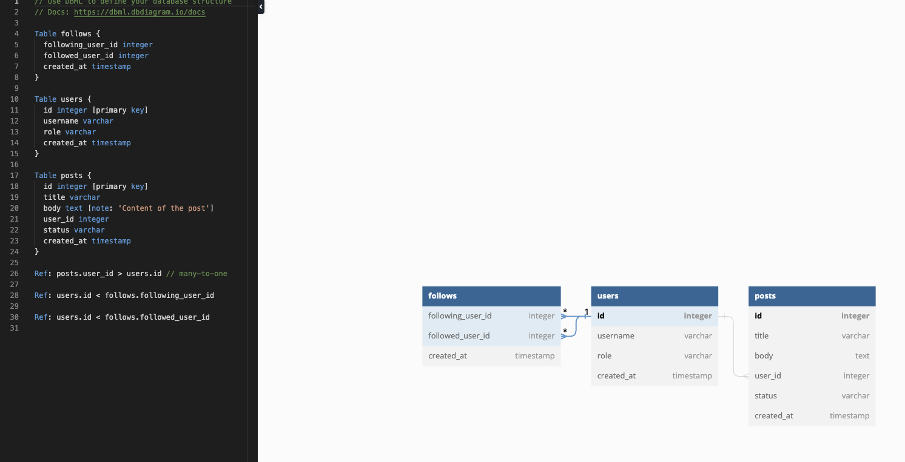

# ch10_database_diagram

## 데이터베이스 다이어그램

데이터베이스에 테이블이 많아지고, 테이블들 간에 관계가 맺어지면 순식간에 구조를 파악하기가 어려워집니다. 이를 쉽게 파악하기 위해서 다이어그램을 활용합니다. 다이어그램은 최대한 단순하게, 테이블에 어떤 컬럼들이 있고, 각 컬럼들이 어떤 데이터 타입을 갖고 있는지를 명시해줍니다. 그리고 primary key를 표기해주고, 테이블 간의 관계를 그려줍니다.

### DB diagram 서비스 이용하기

[https://dbdiagram.io/home](https://dbdiagram.io/home)

직접 한땀 한땀 그릴 수도 있지만, 편하게 그려주는 서비스를 이용해보겠습니다.

왼쪽 패널에서 코드 형태로 테이블의 명세를 입력해주면, 다이어그램을 그려주는 무척 편리한 서비스입니다.

### 테이블 다이어그램 그리기

이전 실습에서 만들었던 items 테이블과 reviews 테이블을 다이어그램으로 표현해보겠습니다. 

먼저 items 테이블에 각 컬럼들의 이름과 데이터 타입을 적어줍니다. 데이터 타입은 간단하게 int, varchar 정도만 적어줍니다. primary key로 지정된 컬럼은 두껍게 표시됩니다.

reviews 테이블도 마찬가지입니다. 컬럼명과 primary key를 명시하여 다이어그램으로 표현합니다.

완성된 다이어그램

### 테이블 간의 관계 설정하기

RDBMS의 꽃, 테이블 간의 관계 설정하기입니다. 가만 보면 reviews 테이블은 items 테이블의 id 값을 자신의 컬럼으로 가지고 있습니다. 즉, 하나의 review 레코드는 반드시 하나의 item_id를 갖습니다. 반면에 하나의 item은 여러 개의 review를 가질 수 있습니다. 이런 관계를 1:N 관계라고 부릅니다. 즉, items 테이블과 reviews 테이블은 각각 [items.id](http://items.id) 컬럼과 reviews.item_id 컬럼을 통해 1:N 관계를 맺고 있는 것입니다. 

이런 관계를 다이어그램 상에 표현해주면 테이블들 간의 관계를 파악하는게 쉬워집니다. 한번 [items.id](http://items.id) 컬럼과 reviews.item_id 컬럼을 연결해보겠습니다.

드래그로 두 컬럼을 연결해보면 왼쪽 패널에 참조 관계를 나타내는 코드가 생성됩니다. reviews.item_id가 items.id를 참조하고 있습니다. 둘 사이에 그려진 선을 보면 items 테이블쪽에는 작대기 하나, reviews 테이블 쪽에는 작대기 세개가 그려집니다. 바로 1:N 관계를 나타내는 것입니다.

연결 관계에 커서를 올려보면 1:N 관계라고 표시가 됩니다.

## 정리

지금까지 데이터 베이스 다이어그램 그리는 방법을 알아봤습니다. 사실 ER Diagram을 근본부터 파고 들면 아래 같은 그림부터 설명드려야합니다. (대학교에서 데이터베이스 수업을 들으면 중간고사때까지 아래 그림 그리는데 시간 보냅니다.)

하지만 이런 종류의 다이어그램은 가독성도 떨어지고, 직관적이지 않아서 실무에서 단 한번도 본 적이 없습니다. 오히려 최신 RDBMS 관리 도구들은 위에 보이는 심플한 형태의 다이어그램을 제공해줍니다. 실제로도 저런 형태의 다이어그램으로 디비 구조를 파악하고, 분석 쿼리를 짜기도 하니, 확실히 알고 넘어갑시다.