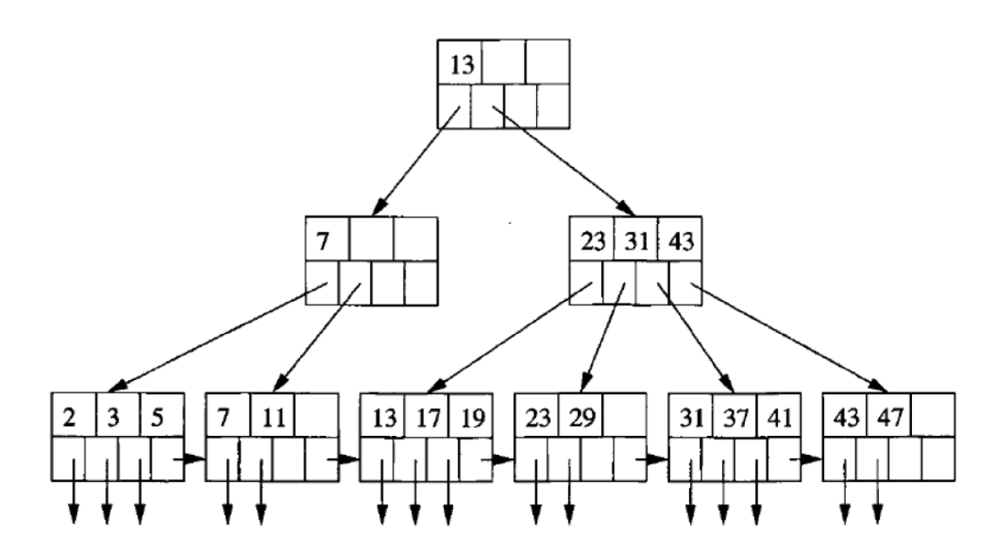

# ch10_index

## Index

RDBMS의 성능 개선의 꽃인 index입니다. 디비에서 인덱스는 성능 개선을 목적으로 특정 컬럼의 값들을 b+tree라는 트리 자료구조 형태로 관리하는 것을 말합니다. b+tree에 대해 간단히 소개하면 자식이 매우 많은 트리를 의미합니다. 그래서 데이터의 수가 아무리 많아져도, 트리의 높이가 그다지 높아지지 않습니다.



기본적으로 RDBMS에서 테이블을 만들면 primary key를 기준으로 인덱스를 생성합니다. workbench 상에서 테이블 Index 정보를 조회하면, primary key로 기본 인덱스가 걸려있는 것을 확인할 수 있습니다.


다시 돌아가서 items 테이블에 auto_increment한 int 값으로 primary key를 설정했다고 가정해보겠습니다. 그러면 아래처럼 b+tree 기반의 인덱스가 자동으로 생성됩니다.


여기서 id 값이 15부터 30인 레코드만 SELECT 문으로 읽어오고 싶다고 SQL를 짜보겠습니다.

```sql
SELECT *
FROM items
WHERE
	id >= 15
	AND id <= 30
```

이 쿼리를 실행시키면 먼저 b+tree를 타고 내려가면서 15보다 같거나 큰 값을 찾습니다. 그 다음 횡으로 이동하면서 30보다 같거나 작은 값을 찾습니다. 이렇게 찾아낸 값들에는 실제 레코드들이 저장되어 있는 주소값이 들어 있습니다. 이 값들을 읽어와서 리턴해주게 됩니다.

즉, b+tree를 사용하여 특정 컬럼에 인덱스를 걸어주면 조회 성능이 대폭 개선됩니다. 그에 대한 트레이드 오프로 저 트리 구조를 유지해야하므로 write와 update 시에 부하가 커집니다. 다만, 일반적으로 조회를 자주하는 컬럼의 경우엔 인덱스를 걸어서 얻게되는 이점이 훨씬 큽니다.

## JOIN 연산과 INDEX

primary key 외에 인덱스가 필요한 상황은 JOIN의 기준이 되는 키 값들입니다. 앞서서 items 테이블과 reviews 테이블은 서로 1:N 관계를 맺고 있었습니다. 그리고 reviews 테이블 안에 들어있는 item_id를 기준으로 items 테이블과 조인을 하여 데이터를 읽어옵니다.


그런데 reviews 테이블에 item_id에는 인덱스가 걸려있지 않습니다. 이 때, reviews 테이블에 1억개의 리뷰가 쌓여있다고 가정하고, JOIN 쿼리를 한번 날려보겠습니다.

```sql
SELECT
	*
JOIN review
ON items.id=reviews.item_id
```

이 경우, items 테이블의 id 값 하나 하나에 대해서 reviews 테이블을 전체적으로 순회하며 일치하는 값들을 찾아야 합니다. 즉, item이 10개라면 총 10억번의 조회를 수행해야 하므로 매우 비효율적이며, 실제 프러덕션 환경에서도 병목을 일으키는 주범 중 하나입니다.

그러면 JOIN의 기준이 되는 item_id에 인덱스를 걸어주면 어떻게 될까요? b+tree 자료구조로 조회를 하면 logN 시간 복잡도가 보장되며, 레코드 수가 1억개일 경우 약 11번 트리를 타고 내려가면 특정 값을 조회할 수 있습니다. 즉, item이 10개라면 총 100번 정도외 연산만으로 조인을 수행할 수 있게 됩니다.  10억번과 100번은 드라마틱한 차이가 있으므로, JOIN 대상 키들에 대해선 인덱스를 걸어주는 것이 좋습니다.

## INDEX 만들기

인덱스를 만드는 것 역시도 SQL 문으로 수행할 수 있습니다. 인덱스의 이름은 보통 “idx_{인덱스 할 테이블 명}_{인덱스 할 컬럼명}”이 됩니다.

```sql
CREATE INDEX "인덱스 명" ON "테이블 명"("인덱스할 컬럼명");
```

```sql
CREATE INDEX idx_reviews_item_id ON reviews(item_id);
```

인덱스의 진가는 데이터의 개수가 많아졌을 때 발휘됩니다.

## 정리

이번 장에서는 데이터베이스에서 아주 중요한 개념인 인덱스에 대해서 다뤄봤습니다. 그리고 JOIN 연산 시에 기준이 되는 컬럼에 인덱스를 걸어주는 것이 왜 중요한지 알아봤습니다. e-commerce 데이터 셋 분석 SQL 문을 날리기전에 꼭 JOIN 기준이 되는 컬럼들에 인덱스를 걸어주세요.s