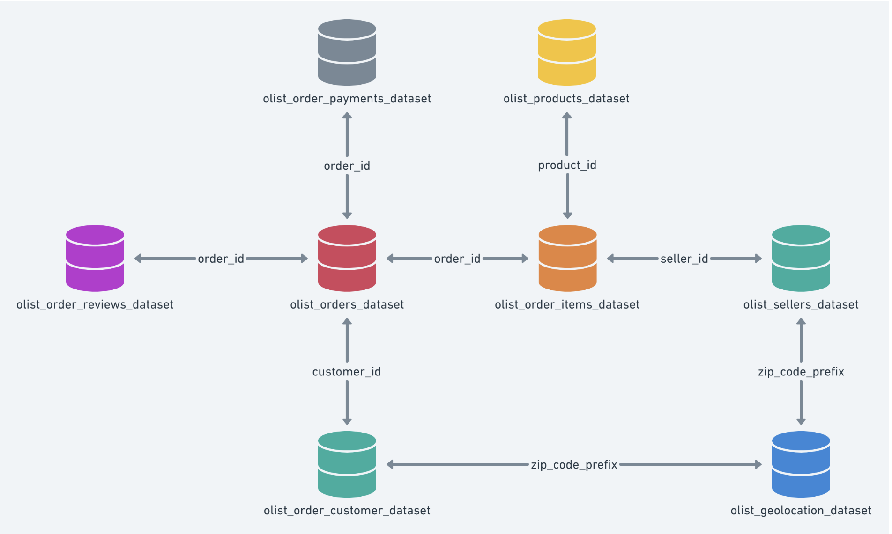

# ch11_ecommerce_db_analysis

## 미니 프로젝트

실제 이커머스 서비스 데이터들을 가지고 직접 데이터 베이스를 구축하고, 분석 작업을 수행해봅니다. 그 과정에서 RDBMS에 대한 이해도를 키웁니다.

## 데이터 소개

[https://www.kaggle.com/datasets/olistbr/brazilian-ecommerce](https://www.kaggle.com/datasets/olistbr/brazilian-ecommerce)

브라질의 ecommerce 기업 Olist가 kaggle에 공개한 자신들의 RDBMS 데이터 셋입니다. 전체 데이터의 양도 100MB 정도로 과하지 않고, 정석적인 테이블 설계를 따르고 있어서 실습에 용이합니다.

## 기본 요구사항

1. 데이터를 열어보고, 테이블 구조를 설계해서 workbench를 이용해 테이블을 만들어보세요. (맨 앞에 붙는 olist와 맨뒤에 붙는 dataset은 뗏습니다.)
    1. 포함 테이블: orders,order_items, sellers, order_customer, order_reviews, product_category_name_translation
    2. 제외 테이블: payments, geolocation
2. python을 이용해서 데이터를 batch 단위로 insert 해보세요.
3. 데이터베이스 다이어그램을 [dbdiagram.io](http://dbdiagram.io) 서비스를 이용해서 그려보세요.
4. 아래 분석 쿼리를 작성해보세요.
    1. 상품 카테고리 별 평균 평점을 집계해보세요.
    2. 매출이 가장 높은 상품 상위 10개를 집계해보세요.
    3. 각 카테고리별로 월별 매출 추이를 시각화해보세요. (sql과 python 이용)

## 도전 과제

해당 기업의 데이터를 가지고 스스로 가설을 세우고, SQL 문으로 분석해서 인사이트를 도출해보세요. 필요하다면 처음 테이블을 만들때 제외했던 payments, geolocation 테이블도 만들어서 사용해보세요.

ex)

- 주요 매출 발생 품목 분석을 통한 마케팅 전략 수립
- 고객 행동 패턴 분석을 통한 CRM 전략 수립
- 배송 지연으로 인한 고객 불만 해결을 위한 전략 수립

### 참고 자료
- [https://velog.io/@chocoscendo/Olist-%EC%9D%B4%EC%BB%A4%EB%A8%B8%EC%8A%A4-%EA%B3%B5%EA%B3%B5-%EB%8D%B0%EC%9D%B4%ED%84%B0%EC%85%8B-%EB%B6%84%EC%84%9D](https://velog.io/@chocoscendo/Olist-%EC%9D%B4%EC%BB%A4%EB%A8%B8%EC%8A%A4-%EA%B3%B5%EA%B3%B5-%EB%8D%B0%EC%9D%B4%ED%84%B0%EC%85%8B-%EB%B6%84%EC%84%9D)