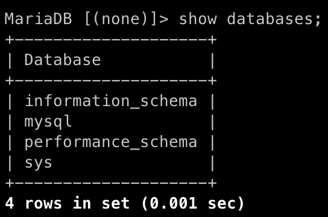

# ch1. database_DDL

## 교재

그림으로 배우는 SQL 입문 0장을 참고해서 복습하시면 됩니다. 교재는 workbench를 사용해서 데이터베이스와 테이블을 생성합니다. workbench를 사용하면 편할 수 있지만 기본 개념을 익히기에 적합하지 않습니다. 이번 장에서는 CLI를 이용해서 실습을 진행해보겠습니다. 수업 후에 교재 0장을 읽어보시고 복습하시면 됩니다.

## SQL문이란?

Structured Query Language의 약자로 RDBMS에서 자료를 관리 및 처리하기 위해 설계된 언어입니다. SQL 문법은 크게 3가지 종류로 나뉩니다.

- DDL(Data Definition Lanuage): 데이터 정의 언어. 어떻게 데이터를 저장할 지 규격을 정하는 문법
- DML(Data Manipulation Language): 데이터 조작 언어. 실제로 데이터를 읽고 쓰는 문법
- DCL(Data Control Language): 데이터 제어 언어. 사용자 관리 및 사용자 별로 릴레이션 또는 데이터를 접근하는 권한을 다루기 위한 언어

실제로 우리가 사용하게 될 대부분의 SQL문들은 DML입니다. 그 중에서도 데이터를 삭제하는 명령보다는 데이터를 추가하고, 읽어오는 문법을 사용하게 됩니다. 데이터 테이블을 생성하거나, 접근 권한을 제어하는 일은 큰 회사의 경우 DBA, 작은 회사의 경우 backend engineer가 보통 수행합니다. 데이터 분석 업무 담당자들은 데이터베이스에 read-only 계정으로 접속해서 DML을 날려서 각종 집계 쿼리들을 날려서 데이터를 분석하게 됩니다.

## DDL이란?

어떻게 데이터를 저장할지 정의하는 SQL 문법입니다. CREATE, ALTER, DROP 등의 키워드가 여기에 속합니다. 데이터베이스를 생성하거나 삭제하고, 테이블을 생성하거나 삭제하는 구문이 여기에 해당합니다.

## 데이터베이스 생성, 삭제

### 데이터 베이스 생성

로컬 환겨에 mariaDB를 설치한 뒤, root 계정으로 접속합니다. 아래 명령어로 mariaDB에 어떤 데이터베이스들이 있는지 살펴봅니다.

```sql
SHOW databases;
```



위 데이터 베이스들은 mariaDB가 내부 시스템을 유지하기 위해 필요한 데이터들을 담는 데이터 베이스들입니다. 가령 유저 계정이나 비밀번호, 문자열 인코딩 등의 정보들이 있습니다. 이 데이터베이스들을 직접 건드릴 일은 아직 없습니다. 우리가 실습을 진행하기 위한 데이터 베이스를 하나 새로 만들어줍니다.

가상의 이커머스 서비스를 하나 가정하고 데이터베이스를 만들어보겠습니다.

```sql
CREATE DATABASE mystore;
SHOW DATABASES;
```


새로 내가 만든 데이터 베이스를 확인할 수 있으면 성공입니다. 

### 데이터 베이스 선택 및 테이블 조회

실습용으로 만든 데이터 베이스를 선택한 뒤, 테이블 목록을 조회해보겠습니다.

```sql
USE mystore;
SHOW TABLES;
```


mystore라는 데이터베이스를 만든 뒤, 아무 테이블도 생성하지 않았으므로 Empty set이라는 결과가 출력되면 성공입니다. 

### 데이터 베이스 삭제

DROP 문을 사용하면 앞서 만든 데이터베이스를 삭제할 수 있습니다. 

```sql
DROP DATEBASE mystore;
```


데이터베이스 삭제 후 show databases를 날려보면 삭제 된 것을 확인할 수 있습니다. 그렇다면 use 문으로 삭제한 데이터베이스를 사용하겠다고 명령을 날려보겠습니다.


데이터베이스가 없다고 출력되면 성공입니다. 이제 다음 실습 진행을 위해서 다시 mystore 데이터베이스를 생성하시면 됩니다.

## 테이블 생성, 삭제

### 테이블 생성

테스트용 테이블을 하나 만들어보겠습니다. 아래 SQL 문은 id, name을 컬럼으로 갖는 item이라는 테이블을 생성하겠다는 SQL문입니다. 자세한 내용은 다음 강의에서 다룰 예정이니, 지금은 따라 치시면 됩니다.

```sql
CREATE TABLE item(
	id int,
	name VARCHAR(255)
);
```


SQL문을 입력한 다음, show tables 라는 명령어를 다시 입력해보면, 내가 생성한 테이블을 확인할 수 있습니다. describe 명령어를 사용하면 테이블의 상세 내역을 볼 수 있습니다.


### 테이블 삭제

테이블을 만들어 보는 것까지 실습을 완료했다면, 이제 생성한 테이블을 삭제해보겠습니다. drop 문을 이용하면 테이블을 삭제할 수 있습니다.

```sql
DROP table items;
```


show tables 명령어로 조회해서 테이블이 안보이면 성공입니다.

## 정리

이번 장에서는 DDL 문을 이용해서 데이터 베이스와 테이블을 생성하고 삭제해보았습니다. RDBMS는 데이터를 저장하기 전에 미리 데이터를 저장하는 형태를 정의한다는 개념만 확실하게 이해하고 넘어가면 좋습니다.