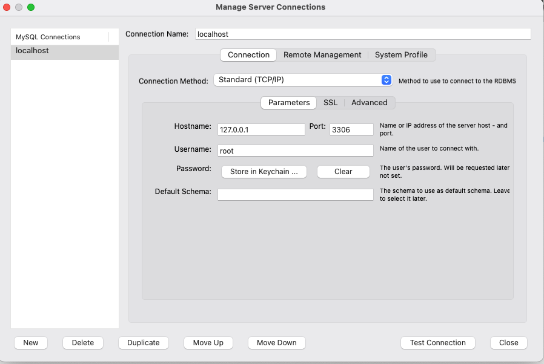

# ch2. create_table

## workbench 사용하기

workbench를 사용하면 여러 유용한 기능들을 제공해줍니다. 가령 SQL문을 작성하지 않고도 데이터 베이스나 테이블을 생성하는 기능들이 있습니다. SQL 문의 문법 검사도 실행 전에 해주고, syntax 자동 완성 같은 기능들도 제공합니다. work bench를 실행하여 로컬 mariaDB에 접속해보겠습니다.



hostname에는 127.0.0.1을 넣어줍니다. (로컬 호스트를 의미하는 IP 주소입니다.) 사용자 명과 패스워드를 넣어준 뒤, 아래 test connection으로 접속을 확인합니다. 그 뒤, 접속하여 아래 화면에서 Schemas 탭으로 이동하면 됩니다. (schema란 데이터를 저장하기 위한 규격을 나타내는 용어입니다.)


여기서 지난 시간에 만들었던 mystore를 확인할 수 있으면 됩니다. mystore에서 우클릭을 한 뒤, Set as Default Schema를 클릭하면, 지난 시간에 배웠던 use “데이터베이스  명” 과 동일한 작업을 수행합니다.


## SQL을 사용하여 테이블 생성하기

RDBMS에서는 항상 데이터를 저장하기에 앞서서 어떠한 형태로 데이터를 저장할 지 정의해야합니다. 이를 스키마를 정의한다고 표현하고, noSQL과 RDBMS를 구분짓는 중요한 특징이 됩니다. 스키마를 정의한다는 말은 곧 테이블을 만들 때, 컬럼명과 데이터 타입을 미리 지정한다는 의미입니다. 이제 우리가 팔고자 하는 상품을 나타내는 테이블을 만들어보겠습니다.

```sql
CREATE TABLE products(
	name VARCHAR(255),
	price INT,
	description VARCHAR(1024)
);
```


위 SQL 문에서 눈여겨 볼 부분은 테이블을 만들 때, 각 컬럼 명과 컬럼의 데이터 타입을 정의한 부분입니다. 특히 데이터 베이스에서는 문자열을 저장할 때 VARCHAR 라는 데이터 타입을 많이 사용합니다. 

## 데이터 타입

테이블 생성 시, 각 컬럼마다 데이터 타입을 지정해주어야 합니다. 모든 데이터 타입을 일일이 암기하고 있을 필요는 없습니다. 필요한 상황에 맞춰서 문서를 읽어보고 선택하면 됩니다. INT, FLOAT, VARCHAR, DATE만 알아도 대부분의 테이블을 정의할 수 있습니다.

전체 데이터 타입: [https://mariadb.com/kb/en/data-types/](https://mariadb.com/kb/en/data-types/)

많이 사용하는 데이터 타입

| 데이터 타입명 | 설명 | 용도 |
| --- | --- | --- |
| INT | +- 21억까지 표현 | 숫자 표현할 때 주로 사용, 매우 큰 값을 담아야할 때는 부적절 |
|  BIGINT | +-9223372036854775808까지 표현 | 아주 큰 숫자까지 담아야하는 숫자형 데이터 표현할 때 사용 |
| FLOAT | 소수점 아래 7자리까지 표현 | 실수값 저장시 사용 |
| VARCHAR(n) | 문자열 저장 시에 사용, CHAR앞에 VAR가 붙은건 가변 길이를 지원해주기 때문. n에 숫자를 집어넣고, 이는 바이트 수를 의미. VARCHAR(256) 이런 식으로 많이 사용. 전체 길이를 가늠할 수 있는 문자열의 경우엔 이 VARCHAR 타입을 사용할 것. | 보통 최대 길이가 예상 가능한 문자열 저장할 때는 VARCHAR를 사용한다. ex) 이메일 주소: VARCHAR(255)  |
| CHAR(n) | 바이트 크기가 고정되는 문자열. | 크기가 무조건 일정한 문자열을 넣어줄 때 적합 ex) 전화번호, 주민등록 번호 등 |
| TEXT | 65535 글자까지 저장할 수 있는 데이터타입. 만약 더 큰 문자열을 저장하고 싶다면 MEDIUMTEXT, LONGTEXT 타입을 사용할 것. 그러나 그 정도로 긴 텍스트라면 RDBMS에 저장하기 보단 파일이나 search engine에 저장하는게 적합함.  | 긴 문자열을 저장해야할 때 사용 |

workbench에서 번개 표시가 있는 Query라는 탭에서 SQL 문을 붙여넣고 번개 모양을 눌러서 실행해보겠습니다.


화면 아래에 초록불이 들어오면 성공입니다. 그 다음 mystore 데이터 베이스를 우클릭 한 뒤, refresh all을 해주면 Tables 아래에 products라는 방금 만든 테이블이 조회가 됩니다.


생성된 테이블을 우클릭해보면 여러가지 작업들을 할 수 있습니다. 그 중 Table Inspect를 해보겠습니다.


Columns 테이블에는 우리가 CREATE 문으로 테이블을 만들면서 정의한 컬럼들과 각 컬럼들의 데이터 타입을 확인할 수 있습니다. 


DDL 탭을 열어보면, 우리가 테이블을 만들 때 사용했던 SQL문을 확인할 수 있습니다.


이제 product table을 우클릭하여 drop 해줍니다.


## workbench GUI를 사용하여 테이블 생성하기


Tables를 우클릭한 뒤, Create Table을 선택하면 테이블을 GUI로 생성할 수 있는 화면이 나옵니다. 이를 이용하면 직접 SQL문을 작성하지 않아도 테이블을 작성할 수 있습니다. 이를 이용해서 아래처럼 products  테이블을 만들어보겠습니다.


컬럼명과 데이터 타입을 선택하여 테이블을 생성합니다. 그런데 데이터 타입 뒤에 PK, NN, UQ 등등을 체크할 수 있는 체크 박스가 있습니다. 각각이 어떤 의미인지는 다음 장에서 공부하기로 하고, 일단은 위에처럼 체크 한 뒤, 오른쪽 아래 Apply 버튼을 눌러보겠습니다.


그러면 워크벤치에서 우리가 입력한 설정대로 테이블을 생성하는 SQL문을 만들어서 이대로 실행하겠냐고 물어봅니다. Apply 버튼을 눌러서 테이블을 생성해줍시다. 이전과 마찬가지로 Tables 아래에서 테이블을 확인할 수 있으면 완료입니다. 

즉, workbench는 우리가 직접 SQL문을 작성하지 않도록 여러가지 편의 기능을 제공해주는 도구라고 이해하면 됩니다. 우리가 workbench를 통해서 데이터베이스를 조작하는 것은 결국 SQL문을 만들고, 그 SQL을 통해서 데이터베이스를 제어하는 것입니다.

## 정리

이번 장에서는 mysql workbench를 이용해서 테이블을 만들어보았습니다. 테이블을 생성하는 기본 문법과 데이터 타입에 대해서 배웠습니다. 그리고 work bench 사용법들을 숙지해보았습니다. 꼭 기억하고 넘어가야할 점은 RDBMS는 데이터를 저장하기 전에 미리 스키마를 생성한다는 점입니다. 이 점을 기억하고 다음 장으로 넘어가겠습니다.