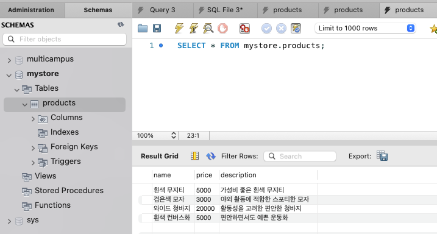

# ch3_insert_select_primary_key

### Insert문 사용

이제 테이블에 데이터를 넣어보겠습니다. 테이블에 데이터를 입력하려면 insert 구문을 사용해야합니다. workbench에서 Query에 아래 SQL문을 입력해보세요.

```sql
INSERT INTO products(name, price, description) 
VALUES
	('흰색 무지티', 5000, '가성비 좋은 흰색 무지티');
```

INSERT INTO 뒤에 데이터를 집어넣을 테이블 명을 적어주고, 괄호 안에 테이블의 컬럼명들을 적어줍니다. 그 다음 VALUES 뒤에 괄호를 붙이고 그 안에 컬럼 순서대로 저장할 데이터를 넣어주면 됩니다. 그 다음 실행하면 데이터가 정상적으로 입력됩니다. 

VALUES 뒤에 데이터를 여러 쌍 입력해주면 한번에 여러개의 데이터를 입력할 수 있습니다.

```sql
INSERT INTO products(name, price, description) 
VALUES
	('검은색 모자', 3000, '야외 활동에 적합한 스포티한 모자'),
	('와이드 청바지', 20000, '활동성을 고려한 편안한 청바지'),
	('흰색 컨버스화', 5000, '편안하면서도 예쁜 운동화')
;
```

### Select 문 사용

테이블에 저장된 데이터를 확인하기 위해서는 select 문을 사용하면 됩니다. 아래 SQL문을 입력하고 실행하면 앞서 입력한 데이터들을 조회할 수 있습니다.

```sql
SELECT * FROM products;
```

위 SQL은 products 테이블에 모든 컬럼을 읽어오겠다는 의미입니다. 번개 모양을 클릭해서 SQL 문을 실행하면 아래 처럼 방금 전 INSERT 문을 통해 입력한 데이터를 조회할 수 있습니다.



직접 SQL문을 입력하지 않고도 products 테이블 위에 커서를 올려놓으면 표시되는 테이블 모양을 클릭하면 바로  데이터를 조회할 수 있습니다. SELECT 문의 더 자세한 사용 방법은 따로 다루겠습니다.

### Primary Key

우리 쇼핑몰이 잘돼서 상품이 더 많이 들어왔다고 가정해보겠습니다. 공교롭게도 “검은색 모자”라는 새로운 상품이 들어왔다고 가정하겠습니다. 두 상품은 이름은 같지만, 가격과 설명이 다른 상품입니다. 이를 테이블에 추가해보겠습니다. 

```sql
INSERT INTO products(name, price, description) 
VALUES
	('검은색 모자', 50000, '고급 브랜드의 야심찬 신상 모자');
```


데이터를 추가한 다음 조회를 해보면 products 테이블에 이름이 “검은색 모자”인 상품이 2개가 존재합니다. 두 상품은 다른 상품이지만, 구분하기가 매우 어렵습니다. 이러면 재고 관리, 매출 집계 등의 작업을 수행하기가 매우 애매해집니다. 이런 현상은 제품이 더 많이 추가될 수록 많이 발생하겠죠? 각각의 상품들을 유니크하게 구분할 수 있는 일련 번호가 있으면 매우 유용할 것입니다.

이처럼 우리는 데이터 베이스에 저장하는 각각의 행(레코드)를 구분하는 값이 필요합니다. 이를 primary key라고 부릅니다. 기억을 되돌려서 workbench에서 테이블을 만들 때, 컬럼에 옵션을 지정하는 부분을 떠올려보겠습니다. 


여기서 PK 체크박스가 해당 컬럼을 primary key로 지정할 것인지를 묻는 것입니다. NN은 non-null, 즉 비어있는 값을 허용하지 않을 것인지 묻는 박스입니다. 그 외 조건들은 차차 설명하겠습니다. 우리가 원하는 것은 각각의 행을 구분할 수 있는 값입니다. 상품명을 나타내는 name은 primary key로 적합하지 않겠죠? 각각의 행의 번호를 나타내는 id라는 컬럼을 추가하는 것이 가장 단순한 해결책이 됩니다.

기존의 products 테이블을 drop하고 새로 만들어 보겠습니다.


그리고 데이터를 한번 추가해보겠습니다. 새로 추가된 id 컬럼까지 포함해서 insert 문을 작성해야 합니다.

```sql
INSERT INTO products(id, name, price, description) 
VALUES
	(1, '흰색 무지티', 5000, '가성비 좋은 흰색 무지티'),
	(2, '검은색 모자', 3000, '야외 활동에 적합한 스포티한 모자'),
	(3, '와이드 청바지', 20000, '활동성을 고려한 편안한 청바지'),
	(4, '흰색 컨버스화', 5000, '편안하면서도 예쁜 운동화'),
	(5, '검은색 모자', 50000, '고급 브랜드의 야심찬 신상 모자');
```


다시 조회를 해보면 각 레코드마다 id 값이 부여되어 있어서 구분하기가 편합니다. 이제 “검은색 모자”라는 상품이 수천개가 추가되더라도 헷갈리지 않고 “몇 번 상품”으로 구분해서 가격과 설명을 가져올 수 있습니다.

### Primary Key의 조건

primary key는 각각의 행들을 고유하게 구분하기 위해서 사용합니다. 따라서 똑같은 값이 존재하면 의미가 없겠죠? 한번 이미 존재하는 id 값으로 데이터를 입력해보겠습니다.

```sql
INSERT INTO producst(id, name, price, description)
VALUES
	(5, '하늘색 원피스', 100000, '봄에 입기 좋은 린넨 소재 원피스입니다.');
```


위 INSERT 문을 실행해보면 PRIMARY 키 값에 duplicate entry (중복값) 이 있어서 데이터 입력에 실패했다고 나옵니다.

### auto_increment Primary Key

중복 값을 허용하지 않는 primary key 값의 특성 때문에 꼬박꼬박 id 값에 1씩 추가해서 insert를 해주어야 합니다. 이를 데이터 베이스가 알아서 해주면 참 편하겠죠? 다시 기존에 만들었던 products 테이블을 drop하고 아래 설정으로 새로 한번 만들어 보겠습니다.


이런 옵션으로 테이블을 생성하면, id 컬럼 옆에 AUTO_INCREMENT라는 조건이 붙습니다. 즉, 테이블에 레코드가 하나씩 추가될 때마다, id 값이 1씩 자동으로 증가해서 입력된다는 소리입니다. 

새로 products 테이블을 만든 뒤, 데이터를 추가해 보겠습니다. 이번에는 insert 문에서 id 컬럼과 값을 제외하고 데이터를 입력하겠습니다.

```sql
INSERT INTO products(name, price, description) 
VALUES
	('흰색 무지티', 5000, '가성비 좋은 흰색 무지티'),
	('검은색 모자', 3000, '야외 활동에 적합한 스포티한 모자'),
	('와이드 청바지', 20000, '활동성을 고려한 편안한 청바지'),
	('흰색 컨버스화', 5000, '편안하면서도 예쁜 운동화'),
	('검은색 모자', 50000, '고급 브랜드의 야심찬 신상 모자');
```


다시 테이블을 조회해보면 데이터를 넣을 때 id 값을 따로 주지 않았지만, 알아서 1씩 증가시키며 id 값을 부여한 걸 알 수 있습니다. 실제로 현업에서는 대부분 이렇게 자동으로 증가하는 int 값으로 primary key 컬럼을 지정합니다. (레코드 행 개수가 엄청 커질 수 있는 테이블은 BIGINT를 활용합니다.)

이제 앞으로 새로 테이블을 생성할 일이 생길 경우, 자동으로 id 컬럼에 PK(primary key), NN(non-null), AI(auto-increment) 옵션을 붙여서 추가해주는 습관을 갖도록 합시다. 

## 연습문제

아래 데이터를 저장할 수 있는 테이블을 만들고, INSERT 문으로 데이터를 입력해보세요.

| 컬럼명 | 데이터 타입 |
| --- | --- |
| id | INT |
| book_name | VARCHAR(45) |
| publisher | VARCHAR(45) |
| price | INT |
| release_date | DATE |

| id | book_name | publisher | price | release_date |
| --- | --- | --- | --- | --- |
| 1 | 이탈리아어 입문 | 세계사 | 1200 | 2019-11-12 |
| 2 | 프랑스어 입문 | 세계사 | 1200 | 2019-11-14 |
| 3 | 어서오세요! 프랑스어 | 언어사 | 980 | 2019-11-15 |
| 4 | 독일어 관용구집 | 언어사 | 800 | 2019-11-15 |
| 5 | Chao! 이탈리아어 | 세계사 | 2300 | 2019-12-01 |
| 6 | 즐거운 이탈리아어 | 글로벌 | 1500 | 2019-12-23 |

## 정리

이번 챕터에서는 생성한 테이블에 데이터를 넣을 수 있는 INSERT 문과 테이블에 넣은 데이터를 조회할 수 있는 SELECT 문의 기본 사용법을 배웠습니다. 그리고 각 행들을 고유하게 구분할 수 있는 primary key의 필요성에 대해서 알아봤고, 테이블 생성 시에 auto_increment 옵션을 준 id 컬럼으로 primary key를 설정하는 방법에 대해서 알아보았습니다. 

## 심화: primary key가 auto_increment int여야 하는 이유

테이블 생성 시에 primary key가 없을 경우, 첫번째 unique 컬럼 값을 primary key로 사용합니다. unique 조건도 갖고 있지 않을 경우, mariaDB가 사용하는 storage engine인 innoDB가 내부적으로 primary key 역할을 하는 값을 생성한다고 합니다. 즉, 모든 테이블은 primary key를 가져야 합니다. 

[https://dev.mysql.com/doc/refman/8.0/en/innodb-index-types.html](https://dev.mysql.com/doc/refman/8.0/en/innodb-index-types.html)

명시적으로 auto_increment id 값을 primary key로 지정하는 것이 데이터 가독성 측면과 성능 측면에서 좋습니다. auto_increment가 성능적으로 왜 유리하냐면, 데이터베이스의 index 구조를 알아야 합니다. 데이터 베이스는 b+ tree라는 트리 구조로 인덱스 데이터를 저장합니다. 테이블에 별다른 설정을 하지 않을 경우, primary key로 인덱스를 합니다. 이 때, auto_increment하면 중구 난방으로 흩어져서 데이터가 추가되지 않고, 트리의 가장 오른쪽 끝부분에 순차적으로 데이터가 추가되어 파편화 이슈가 작아서 오버헤드가 더 적습니다.