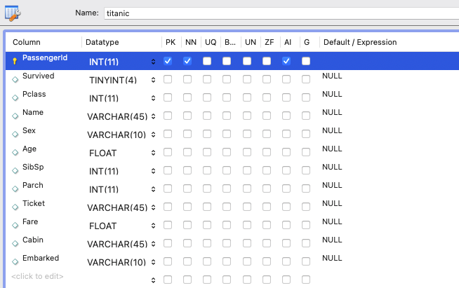

# ch4_import_csv_into_table

## import csv

지금까지 테이블을 생성하고, 데이터를 입력하고, 조회하는 기본 원리와 SQL 문법들을 공부했습니다. 본격적으로 SQL 문법들을 공부하기 이전에 미리 데이터를 채워넣어 보겠습니다.

python 기초 문법을 공부하면서 사용했던 타이타닉 train.csv 데이터를 RDBMS에 저장해보겠습니다. 먼저 데이터를 저장하기 위해 테이블을 생성해줍니다. 컬럼명을 지정할 때 오타가 나지 않도록 조심해주세요.

그 다음, Table Data Import Wizard를 실행합니다.

실제 CSV 컬럼이랑 미리 만들어 둔 테이블의 컬럼명을 일치시킨 다음, 데이터를 import 합니다. Age 값이 비어있는 일부 행들을 제외한 714행이 import되면 성공입니다. 지금은 SQL문을 익히기 위해 data를 import 하는 것이므로 넘어갑니다.

이렇게 데이터를 조회할 수 있으면 성공입니다.

## 정리

workbench의 기능을 이용해서 미리 사전에 테이블을 만들어 놓고, CSV 파일로부터 데이터를 일괄적으로 읽어와 입력할 수 있었습니다.