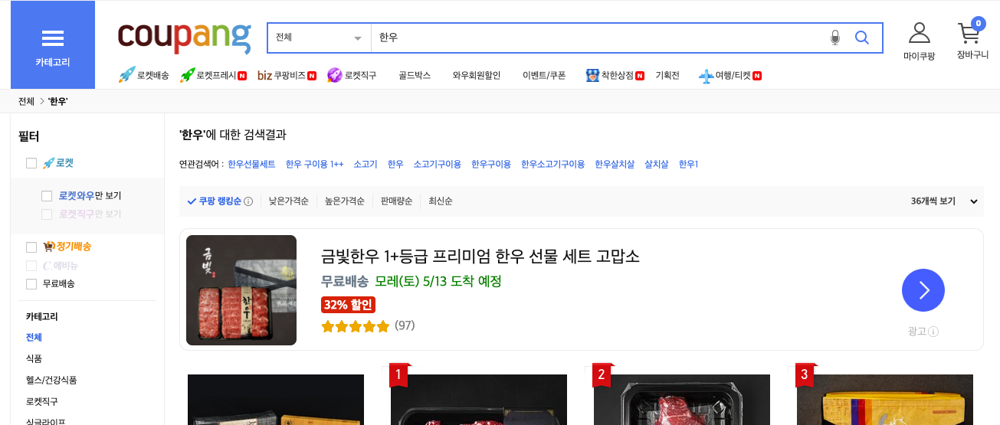

# ch5_select_where_limit_offset

### select 문 사용하기

테이블에 저장된 데이터를 읽어오기 위해선 select문을 사용하면 됩니다. 기본 문법은 아래와 같습니다.

```sql
SELECT 컬럼_1, 컬럼_2, ...
FROM 테이블명
```

먼저 SELECT * FROM 테이블 명 구문을 사용하면 모든 컬럼의 데이터를 읽어오겠다는 의미입니다. 지난 시간에 import 한 타이타닉 데이터를 SELECT 문으로 읽어보겠습니다.

```sql
SELECT * 
FROM titanic;
```

다음으로 Survived, Name, Age 컬럼만 읽어보겠습니다.

```sql
SELECT Survived, Name, Age
FROM titanic;
```

### Where 절 사용하기

특정 조건을 만족하는 데이터들만 읽어오고 싶을 때는 where 문을 사용합니다. if 문과 비슷하게 여러 조건을 중첩시킬 수 있습니다.

한번 생존한 사람들의 이름만 읽어와 보겠습니다. python if문으로 조건문을 코딩할 때와는 다르게 =을 한번만 사용해서 같은지 여부를 비교하겠습니다.

```sql
SELECT *
FROM titanic
WHERE Survived=1;
```

python에서 and와 or을 사용해서 여러 조건을 중첩시킨 것처럼 SQL에서도 이런 논리 연산자를 사용해서 조건들을 중첩시킬 수 있습니다. 한번 생존자들 가운데 남성만 읽어와 보겠습니다.

```sql
SELECT *
FROM titanic
WHERE 
	Survived=1
	AND Sex="male"
```

조건문에 범위를 지정할 수도 있습니다. 생존자들 가운데 30대 남성만 읽어오도록 조건문을 중첩시켜 보겠습니다.

```sql
SELECT *
FROM titanic
WHERE 
	Survived=1
	AND Sex="male"
	AND Age >= 30
	AND Age < 40;
```

이번에는 OR문을 사용해서 조건문을 사용해보겠습니다. 생존자들 가운데 30대 남성, 40대 여성만 읽어보겠습니다.

```sql
SELECT *
FROM titanic
WHERE
	Survived=1
	AND (
		(Sex="male" AND Age >= 30 AND Age < 40) 
		OR (Sex="female" AND Age >= 40 AND Age < 50)
	)
```

### 연습 문제

1. 1등석 승객들 중 생존자들의 명단을 읽어오세요.
2. 1등석 승객들 중 30세 이하 생존자들의 명단을 읽어오세요.
3. 운임을 50달러 이하로 지불한 승객들 가운데 승선지가 C 혹은 Q 인 사람들을 읽어오세요.
4. 부모, 자식이 한명이라도 탑승한 승객들 가운데 사망한 사람의 목록을 읽어오세요.

### Order by

원하는 조건으로 데이터를 정렬할 때 사용합니다. 먼저 나이 순으로 정렬하여 데이터를 읽어보겠습니다.

```sql
SELECT * 
FROM titanic 
ORDER BY Age;
```

WHERE 문과 함께 사용할 수도 있습니다. 생존자들을 나이 순으로 정렬하여 읽어보겠습니다.

```sql
SELECT * 
FROM titanic 
WHERE Survived=1
ORDER BY Age;
```

ORDER BY 는 기본적으로 오름차순으로 데이터를 정렬합니다. ORDER BY 뒤에 DESC를 붙여주면 내림차순으로 정렬할 수 있습니다. 생존자들을 나이 내림차순으로 정렬하여 읽어보겠습니다.

```sql
SELECT * 
FROM titanic 
WHERE Survived=1
ORDER BY Age DESC;
```

### LIMIT, OFFSET 문 사용

SELECT 문으로 데이터를 읽어올 때, 읽어오고 싶은 최대 데이터 개수를 지정할 때 사용합니다. 예를들어 쿠팡에는 수백개의 한우 제품이 있지만 이를 그대로 유저에게 보여주는 것은 리소스도 낭비되고, 유저에게 좋은 경험을 제공하지 못합니다. 때문에 읽어오고 싶은 만큼만 데이터를 읽어올 필요가 있는데, 이런 기법을 페이지네이션이라고 부릅니다.




타이타닉 데이터 셋으로 페이지네이션을 연습해보겠습니다. 생존자들 가운데 나이가 많은 상위 10명을 읽어보겠습니다.

```sql
SELECT * 
FROM titanic 
WHERE Survived=1
ORDER BY Age DESC
LIMIT 10;
```

다음으로 생존자들을 연령으로 오름차순 정렬한 뒤, 10명 단위로 페이지를 나누어 읽어보겠습니다.

```sql
SELECT * 
FROM titanic 
WHERE Survived=1
ORDER BY Age
LIMIT 10
OFFSET 0; # 1페이지
```

```sql
SELECT * 
FROM titanic 
WHERE Survived=1
ORDER BY Age
LIMIT 10
OFFSET 10; # 2페이지
```

```sql
SELECT * 
FROM titanic 
WHERE Survived=1
ORDER BY Age
LIMIT 10
OFFSET 20; # 3페이지
```