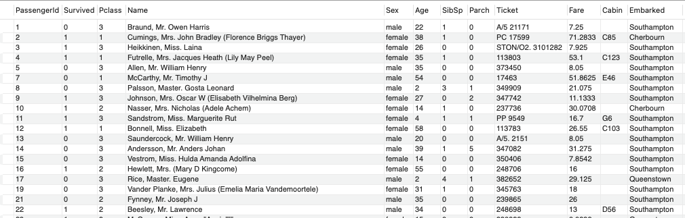

# ch6_update_delete_alter

## Update 문의 사용

테이블 안에 들어있는 데이터를 변경하고 싶다면 update문을 사용하면 됩니다.

```sql
UPDATE "테이블 명"
SET "컬럼명"="변경하고자 하는 값"
WHERE "조건"
```

workbench에서 여러 줄을 한꺼번에 업데이트 하거나 삭제하려면 Safe 모드를 해제해야합니다. 실습을 위해서 이를 먼저 해제하겠습니다.

```sql
SET sql_safe_updates=0;
```

예를들어 titanic 테이블에 Embarked 컬럼은 승선지의 첫 글자를 따서 C, Q, S 값을 가집니다. 이것은 헷갈리므로, 승선지 이름으로 변경해보겠습니다. (C = Cherbourn, Q = Queenstown, S = Southampton)

```sql
UPDATE titanic
SET Embarked="Cherbourn"
WHERE Embarked="C";

UPDATE titanic
SET Embarked="Queenstown"
WHERE Embarked="Q";

UPDATE titanic
SET Embarked="Southampton"
WHERE Embarked="S";
```



## 연습 문제

1. 다시 Embarked 컬럼을 승선지의 첫글자로 변경해보세요. 
2. Fare가 소숫점으로 들어가 있는 점이 마음에 들지 않습니다. UPDATE 문과 CAST를 이용해서 정수로 변경해보세요.

두 작업을 마친 테이블 모습입니다.


## Delete 문의 사용

테이블 안에 들어있는 데이터를 삭제하고 싶다면 DELETE 문을 사용하면 됩니다. 하지만 현업에서는 위험성 때문에 데이터 분석가들은 사용할 일이 거의 없는 문법입니다. 이런게 있구나 정도로 알고 넘어가면 됩니다.

```sql
DELETE FROM "테이블 명"
WHERE "조건"
```

한번 titanic 테이블에서 남성인 레코드를 지워보겠습니다.

```sql
DELETE FROM titanic
WHERE Sex="Male"
```

## 연습 문제

1. 남성들을 지운 상태에서, 다시 10세 이하 데이터들을 지워보세요.
2. PassengerId가 888인 레코드를 지워보세요

여기서 알 수 있는 DELETE 문의 문제점은 한번 데이터를 지우면 복구가 매우 힘들다는 점입니다. 때문에 현업에서는 실제로 DELETE를 때리지 않고, 삭제되었음을 나타내는 deleted 컬럼에 True 값을 넣는 것으로 DELETE를 대체합니다. 이를 soft delete라고 부릅니다.

## Column 추가

한번 직접 titanic 테이블에 boolean 타입의 deleted 컬럼을 추가해 보겠습니다. 테이블에 컬럼을 추가하고 싶을 때는 ALTER 문을 사용합니다.

```sql
ALTER TABLE "테이블 명"
ADD "컬럼명" "데이터타입" DEFAULT "기본값"
```

타이타닉 테이블에 레코드 삭제 여부를 나타내는 deleted 컬럼을 추가해보겠습니다.

```sql
ALTER TABLE titanic 
ADD deleted BOOLEAN DEFAULT false;
```


deleted 컬럼이 잘 추가되었고, false를 나타내는 0으로 값이 잘 들어가 있습니다.

## Soft Delete

deleted 컬럼을 추가했으니 이제 soft deleted를 수행해보겠습니다. 10세 초과 여성 데이터만 남아있는 테이블에서 3등석 승객들을 모두 soft delete 해보겠습니다.

```sql
UPDATE titanic
SET deleted=true
WHERE Pclass=3
```

그리고 데이터를 읽어올 때, 삭제되지 않은 컬럼들만 읽어오겠습니다.

```sql
SELECT * 
FROM titanic
WHERE deleted=false;
```


## 정리

이번 장에서는 테이블의 데이터를 UPDATE문과 DELETE문으로 수정하고 삭제할 수 있는 방법을 배웠습니다. 그리고 DELETE 문으로 한번 데이터를 삭제하면 되돌리기가 어렵기 때문에 SOFT DELETE라는 기법을 사용한다는 것과,  ALTER 문으로 테이블에 컬럼을 추가하는 방법을 배웠습니다.