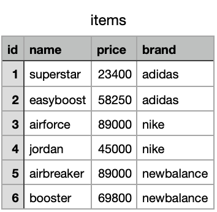

# ch9_join

## 여러 개의 테이블

자, 먼저 제품 정보를 담은 items 테이블이 있다고 가정하겠습니다. 실제 이커머스 서비스라면 훨씬 더 복잡한 구조로 데이터들을 저장하고 있을 겁니다.



그런데 상품에 리뷰를 남길 수 있는 기능이 추가되었다고 생각해보겠습니다. 이런 경우, 보통 리뷰 데이터만 담은 테이블을 새로 만들어줍니다. 그리고 어느 아이템에 대한 리뷰인지 id 값을 포함시킵니다.


이제 테이블을 나누어서 데이터를 저장할 수 있게 되었습니다. 그리고 각각의 테이블은 불필요한 정보를 저장하지 않고, 단순한 형태를 유지하고 있습니다. 위 테이블에서 가령 2번 아이템인 에어포스에 대한 리뷰만 가져오고 싶을 경우 아래 SQL 문을 사용하면 됩니다.

```sql
SELECT *
FROM reviews
WHERE item_id=1
```

그런데 두 테이블에 나누어져 있는 데이터들을 합쳐서 보고 싶을 경우, 어떻게 할까요? 예를들어 상품의 이름과 가격, 그리고 평균 평점을 하나의 SQL 문으로 보고 싶다면 어떻게 할까요? 이 때 활용할 수 있는 문법이 JOIN입니다.

## join 사용

서로 다른 두 테이블의 데이터를 합치는 것을 join이라고 부릅니다. SQL의 꽃이자 알파이자 오메가가 바로 이 join입니다. join query를 이용해서 테이블 단위로 쪼개져 있는 데이터들을 합쳐서 원하는 결과를 가져올 수 있습니다.

### 데이터 셋 준비

쇼핑몰에서 판매하는 상품 정보를 나타내는 items와 각 아이템별 리뷰를 나타내는 reviews 테이블이 먼저 준비되어 있어야 합니다.


### where문을 사용한 join

where문을 사용하면 두 테이블을 조인할 수 있습니다. FROM 문 뒤에, 데이터를 가져올 테이블들을 적어주고, WHERE문 조건에서 item 테이블의 id 값과 reviews 테이블의 item_id 값이 같을 때라는 조건을 붙여서 SQL문을 실행해보겠습니다.

```sql
SELECT *
FROM
	items,
	reviews
WHERE
	items.id=reviews.item_id
```


SELECT 문에 데이터를 가져오고자 하는 컬럼 명을 명시해줄 수 있습니다.

```sql
SELECT
	items.id,
	items.name,
	items.price,
	reveiws.rating
FROM
	items,
	reviews
WHERE
	items.id=reviews.item_id
```


### Join문을 사용한 join

JOIN이라는 키워드를 사용하면 더 세밀한 방식으로 데이터를 합칠 수 있습니다. 

```sql
SELECT
	*
FROM
	items
JOIN 
	reviews 
ON
	reviews.item_id=items.id
```


### Inner Join

앞서서 WHERE 문과 JOIN 문으로 두 테이블을 합치는 것을 익혀봤습니다. 그런데 리뷰가 달려있지 않은 2번, 5번 상품들은 결과에서 누락되는 현상이 발생했습니다. 이는 테이블 데이터를 합칠 때, 두 테이블의 교집합에 해당하는 영역만 읽어와서 그렇습니다. 이런 JOIN 방식을 INNER JOIN이라고 부릅니다.


### LEFT JOIN

자 그러면 교집합이 아니라 한쪽의 결과를 모두 포함하도록 JOIN을 하거나, 합집합을 읽어올 수도 있겠죠? 이런 방식들을 LEFT JOIN, RIGHT JOIN, OUTER JOIN이라고 부릅니다. 하나씩 해보겠습니다.

먼저 LEFT JOIN을 해보겠습니다. Table 1을 기준으로 JOIN 조건에 부합하는 데이터만 합쳐줍니다. 만약 Table1 레코드들 가운데 Table2에 조건이 부합하는 레코드가 없더라도, 결과에 포함되어 출력됩니다.


```sql
SELECT
	*
FROM
	items
LEFT JOIN 
	reviews 
ON
	reviews.item_id=items.id
```


결과를 보면 2번과 5번 상품도 포함되어 있는걸 알 수 있습니다. 

### RIGHT JOIN & OUTER JOIN


Table 2를 기준으로 LEFT JOIN과 동일한 기능을 수행합니다만, 잘 사용하지 않습니다. LEFT JOIN을 많이 사용하므로 이는 스킵하겠습니다.


두 테이블의 데이터의 합집합을 구하는 JOIN 방식입니다. 하지만 이는 사용하지 않습니다. 개념적으로만 이런게 있구나 정도로 이해하고 넘어가면 됩니다.

## Group By with JOIN

JOIN을 이용해서 합친 데이터로 GROUP BY를 적용하여 각종 통계 지표들을 산출할 수 있습니다. 예를들어 각 브랜드별 평균 평점을 구해보겠습니다.

```sql
SELECT
	items.brand,
    AVG(reviews.rating) AS avg_rating
FROM
	items
LEFT JOIN 
	reviews 
ON
	reviews.item_id=items.id
GROUP BY
	items.brand;
```


### 연습 문제

1. 각 상품별 평균 평점을 구해보세요.
2. 평점이 4점 이상인 상품들의 평균 가격을 구해보세요
3. [https://leetcode.com/problems/combine-two-tables/](https://leetcode.com/problems/combine-two-tables/)
4. [https://leetcode.com/problems/replace-employee-id-with-the-unique-identifier/](https://leetcode.com/problems/replace-employee-id-with-the-unique-identifier/)

## 정리

이번 챕터에서는 두 테이블을 합치는 JOIN에 대해서 알아봤습니다. 이제 SQL문을 자유자재로 사용하며, 여러 테이블에 흩어져 있는 데이터들을 하나로 합쳐서 다양한 인사이트를 뽑아낼 수 있게되었습니다. 간단한 JOIN은 WHERE문을, 복잡한 JOIN은 LEFT JOIN과 일반 JOIN문을 많이 사용하니, 그 점을 기억하고 넘어가면 좋겠습니다.
