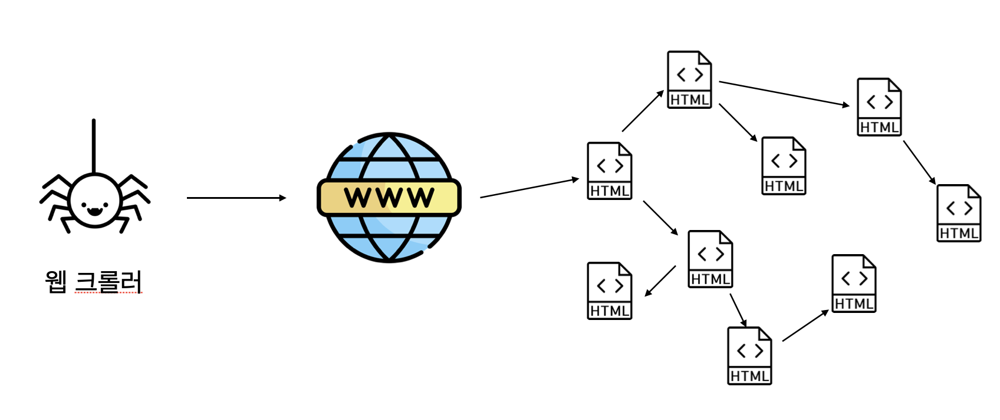

# ch5_1_web_crawling_basics

## 웹 크롤링이란?

웹 크롤링이란 처음엔 구글과 같은 검색엔진을 만들기 위해서 탄생한 기술입니다. 웹 크롤러는 웹을 광범위하게 탐색하면서 html 문서를 수집합니다. 검색엔진은 이를 잘 정리해서, 검색어가 들어오면 가장 연관성이 높은 문서를 리턴해줍니다.

그런데 우리가 만들고자 하는 웹 크롤러는 데이터 분석을 하기 위해서 특정 사이트에서 데이터를 수집하는 것입니다. 즉, 목적 자체가 광범위한 웹 문서 수집이 아니라, 특정 웹 서비스로부터 데이터를 가져오는 것입니다. 이를 기술적으로 말하면 우리가 만들게 될 크롤러는 HTTP 프로토콜을 이용하여 특정 서비스로부터 데이터를 수집하는 프로그램입니다.

따라서 크롤러를 개발하기 위해선 먼저 웹 사이트가 동작하는 원리를 이해해야 합니다. 이를 이해하면 어떤 웹사이트던지 동작 원리를 분석하고, 원하는 데이터를 수집하는 크롤러를 개발할 수 있습니다.

웹을 이루는 기술들로는 프론트엔드와 백엔드가 있습니다. 이 둘의 차이를 이해하고, 데이터를 주고 받는 과정을 이해하면 웹 크롤러 개발이 훨씬 쉬워집니다.

## 프론트엔드

프론트엔드는 쉽게 표현하면 우리 눈에 보이는 화면을 만들고, 클릭이나 드래그 등 우리가 브라우저를 통해서 수행하는 여러 동작들을 구현하는 기술들을 말합니다. 대표적으로 HTML, CSS, Javascript가 있습니다. 최근에는 Javascript로 만든 react 같은 프레임워크를 이용한 프론트엔드 개발이 유행인데요, 결국은 어떻게하면 더 쉽고 효율적으로 저 3가지 요소들을 잘 코딩할지 도와주는 도구라고 생각하면 됩니다.

우리가 브라우저의 주소창에 www.naver.com과 같은 도메인 주소를 입력하면, 브라우저는 해당 주소의 웹 서버에 HTTP 요청을 보내게 됩니다. 요청을 받는 서버는 다시 브라우저에 HTML, CSS, Javascript 파일을 리턴해줍니다. 이 파일들을 이용해서 렌더링 된 화면을 보는 것이 우리가 웹 서비스를 이용하는 방식입니다.

예를 들어서 브라우저를 이용해서 [www.naver.com](http://www.naver.com)으로 요청을 보낼 경우, 네이버의 서버가 이 요청을 받아서 네이버 메인 화면을 그리는데 필요한 html, css, javascript 파일을 우리 컴퓨터로 전송해줍니다. 그러면 브라우저가 이 파일들로 화면을 그려줍니다.

한번 네이버 메인 화면에서 우클릭을 한 뒤, 다른 이름으로 저장하여 결과를 확인해보겠습니다. 웹 페이지 전부 옵션을 선택하여 다운받으시기 바랍니다.

그 결과를 보면 네이버 메인 화면 html 파일과, CSS, Javascript, 이미지 파일들이 저장된 것을 볼 수 있습니다.

한번 NAVER.html 파일을 더블클릭해서 열어보겠습니다.

주소창에 www.naver.com이 아닌, 내가 웹 페이지를 저장한 주소가 나옵니다. 즉, 네이버 쪽 서버로부터 전송 받는 html, css, javascript를 미리 저장해놓고, 이를 브라우저로 그대로 렌더링해도 동일한 웹 사이트 화면을 볼 수 있습니다. 이렇듯 우리가 눈으로 보는 웹 사이트를 그려주는 기술이 프론트엔드입니다. (HTML, CSS, Javascript 는 이어지는 챕터들에서 다룹니다.)

## 웹 백엔드

### 서버 사이드 렌더링

자 그런데 웹 사이트의 생김새는 똑같은데 보여주는 내용이 다른 경우가 있습니다. [https://search.naver.com/search.naver?query=뉴진스](https://search.naver.com/search.naver?query=%EB%89%B4%EC%A7%84%EC%8A%A4) 라는 URL과 [https://search.naver.com/search.naver?query=bts](https://search.naver.com/search.naver?query=bts) 라는 URL로 요청을 날려보겠습니다. 각각 네이버에 뉴진스와 bts를 검색한 결과를 요청하는 URL 들입니다.

분명 모양새는 비슷한데 보여주는 내용은 다릅니다. 바로 각각의 검색어어 따라서 서버가 내려주는 결과가 달랐기 때문입니다. 바로 프론트엔드 파일을 내려주기 전에, 네이버의 검색 백엔드 서버에 요청을 보내어 검색 결과를 가져온 뒤, HTML 파일을 조립하여 내려주기 때문입니다.

이처럼 백엔드 서버란 프론트엔드를 통해서 보여주는 데이터를 내려주는 역할을 수행하는 서버라고 생각하면 됩니다. 그리고 네이버 검색 결과 화면처럼 웹 서버 단에서 백엔드 데이터를 받아와서 html 문서 안에 그 데이터를 넣은 채로 브라우저에 내려주는 방식을 서버 사이드 렌더링(Server Side Rendering) 이라고 부릅니다. 

### 클라이언트 사이드 렌더링

또 다른 방식으로는 프론트엔드 파일들을 먼저 전송해주고, 필요한 데이터를 그 때, 그 때 백엔드에 요청하여 프론트엔드에 그려주는 클라이언트 사이드 렌더링(Client Side Rendering)이 있습니다. 한번 네이버에 뉴진스라고 검색하고, 동 사상 을 택선한 뒤 스크롤을 쭉쭉 내려보도록 하겠습니다.

스크롤이 내려감에 따라서 이전에 올라왔던 동영상들도 가져와서 화면에 보여줍니다. 즉, 화면을 그려주기 위한 HTML, CSS, Javascript 파일들은 미리 다운받고, 화면을 그려주기 위한 데이터가 더 필요할 경우 그 때, 그 때 백엔드 서버에 HTTP 요청을 보내서 데이터를 가져와서 클라이언트에 내려주는 방식입니다.

### Web Application Server의 구조

이런 백엔드를 서버를 Web Application Server, 줄여서 WAS라고도 부릅니다. 그리고 이 백엔드 서버는 주로 데이터베이스를 뒷 단에 두고, 요청이 들어오면 데이터 베이스에 쿼리를 날려서 데이터를 가져와 리턴해주는 역할을 수행합니다.

## 웹 서비스 동작 방식에 따른 크롤러 설계

다시 웹 크롤러로 돌아와 보겠습니다. 우리가 크롤러를 개발하는 목적은 데이터 수집입니다. 그러려면 먼저 데이터를 수집하고자 하는 웹 사이트가 어떤 방식으로 동작하는지 분석해야합니다. 웹 사이트가 동작하는 방식에 따라서 크롤러의 설계가 달라지기 때문입니다.

서버 사이드 렌더링 방식으로 동작한다면 특정 주소로 HTTP 요청을 보내서 HTML 문서를 수집한 뒤, 그 안에 들어있는 데이터를 추출하면 됩니다. 클라이언트 사이드 렌더링 방식으로 동작한다면 백엔드에 요청을 직접 보낸 뒤, 그 안에 들어있는 데이터를 추출하면 됩니다.

웹 서비스를 개발하는 방식이 워낙 다양해지고 고도화되어 클라이언트 사이드 렌더링과 서버 사이드 렌더링이 모두 적용된 서비스들도 있습니다. 중요한 것은 우리가 수집하고자 하는 데이터가 어떤 식으로 서버로부터 내려오는지를 파악하는 것입니다. 다음 장에서는 개발자 도구를 이용해서 이를 파악하는 방법을 배워보겠습니다.

## 정리

지금까지 웹 크롤러의 기본적인 개념과 웹을 이루는 기본 요소들에 대해서 배워봤습니다. 우리가 개발할 크롤러는 특정 서비스로부터 데이터를 수집하기 위한 프로그램이고, 이를 위해서는 웹이 동작하는 기본 방식을 이해해야 한다고 배웠습니다. 프론트엔드와 백엔드의 기본 구성을 배웠고, 클라이언트 사이드 렌더링과 백엔드 사이드 렌더링의 차이를 배웠습니다. 개념들이 쏟아져 나와서 이해가 어려울 수 있지만, 직접 프론트엔드와 백엔드 개발을 해보면 쉽게 개념을 익힐 수 있으니, 조금만 기다려주세요.