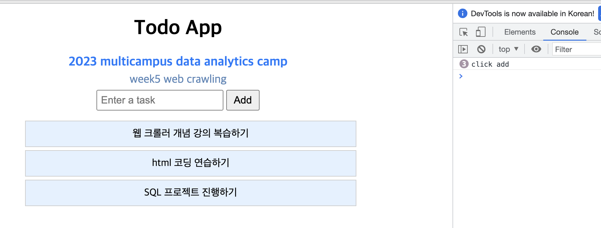

# ch4_javascript

## Javascript

javascript는 웹 브라우저에서 동작하며, 웹 페이지에 생동감을 불어넣기 위해 개발된 프로그래밍 언어입니다. 예를들어 버튼을 눌러서 서버에 데이터를 요청하여 받아오거나, 애니메이션을 구현하거나, 사용자와 상호작용 하는 기능들은 모두 javascript 언어로 만들어지는 것들입니다.

조금만 더 기술적인 얘기를 하자면, 원래 브라우저에서만 동작하도록 만들어진 이 javascript라는 언어를 백엔드 사이드에서도 동작 가능하도록 만든 자바스크립트 실행 환경 런타임을 nodeJS라고 부릅니다. 이 nodeJS가 배우기 쉽고, 프론트엔드와 백엔드를 모두 하나의 언어로 개발할 수 있다는 장점이 생기면서 javascript 언어의 인기가 급상승하기 시작합니다. (지금으로부터 약 10년전 쯤)

nodeJS의 등장으로 javascript의 인기가 높아지면서 언어 레벨의 개선도 이루어졌습니다. 또한 javascript의 한계를 보완하는 typescript라는 프로그래밍 언어가 등장하기도 했습니다. 이에 발맞추어 javascript를 기반으로웹 프론트엔드를 개발할 수 있는 vue나 react 같은 프레임워크들이 등장하여 폭발적인 인기를 끌었고, 현재는 웹 프론트엔드 개발 진영은 거의 react가 평정하였습니다.

이처럼 20년 전만 하더라도 브라우저 안에서만 동작하던 언어가 이제는 프론트엔드, 백엔드 개발이 모두 가능한 가장 사랑받는 언어가 되었습니다. 그렇다면 javascript란 무엇인지 간단한 예제를 통해서 배워보겠습니다.

## HTML에서 javascript 파일 연결하기

CSS와 비슷하게 javascript를 사용하기 위해서는 HTML 코드에서 javascript를 사용하겠다는 태그를 추가해주어야 합니다. body 태그를 닫기 바로 위에 script 태그를 추가해주세요. 그리고 input과 button에 각각 id를 부여해주세요.

```html
<html>
  <head>
    <title>Todo App</title>
		<link rel="stylesheet" type="text/css" href="styles.css">
  </head>
  <body>
		<div id="todo-container">
      <h1>Todo App</h1>
			<p id="program-name">2023 multicampus data analytics camp</p>
			<p id="program-course">week5 web crawling</p>
      <input **id="todo-input"** type="text" placeholder="Enter a task">
      <button **id="add-button"**>Add</button>
      <ul id="todo-list">
        <li class="todo-item">웹 크롤러 개념 강의 복습하기</li>
        <li class="todo-item">html 코딩 연습하기</li>
        <li class="todo-item">SQL 프로젝트 진행하기</li>
      </ul>
    </div>
    **<script src="script.js"></script>**
	</body>
</html
```

```jsx
var addButton = document.getElementById("add-button");
addButton.addEventListener("click", function () {
  console.log("click add");
});
```

javascript도 python과 비슷한 프로그래밍 언어입니다. 어렵게 생각할 것이 없습니다. 첫번째 줄을 보면 var addButton 이라는 말은 addButton이라는 변수(var)를 만들겠다는 말입니다. 그 다음 document.getElementById(”todo-input”)이라는 말은 웹 문서로부터 add-button이라는 id 값을 가진 element를 가져온다는 말입니다.

### Javascript 이벤트 리스너 설정

그 아래에 addButton.addEventListener() 부분은 addButton을 유저가 클릭했을 때, 실행되는 함수를 정의하겠다는 말입니다. 위 예제에서는 “click add”라는 로그를 남깁니다.



그리고 나서 개발자 도구를 연 뒤, Add 버튼을 눌러보면 누를 때 마다 click add라는 로그가 찍히는 것을 확인할 수 있습니다. 이제 우리는 웹 페이지 상에서 유저의 행동에 상호작용하는 서비스를 개발할 수 있게 되었습니다!

### Javascript에서 HTML input 값 가져오기

우리가 하고 싶은 것은 유저가 새로운 todo item을 입력한 뒤, Add 버튼을 누르면 todo list에 추가되는 것입니다. 이를 위해서 먼저 유저가 입력한 값을 javascript에서 가져올 수 있어야 합니다. 이전에 작성한 javascript 코드를 수정해보겠습니다.

```jsx
var addButton = document.getElementById("add-button");
var todoInput = document.getElementById("todo-input");

addButton.addEventListener("click", function () {
  var todoText = todoInput.value;
  console.log("todo input", todoText);
});
```

그 다음, 새 todo item을 브라우저 상에서 입력한 뒤, Add 버튼을 눌러보겠습니다.


## Javascritp에서 HTML element 추가하기

마지막으로 유저가 입력한 todo item을 기존 todo list에 추가해준 뒤, 유저가 입력한 값을 지워주면 끝입니다.

```jsx
var todoInput = document.getElementById("todo-input");
var addButton = document.getElementById("add-button");
var todoList = document.getElementById("todo-list");

addButton.addEventListener("click", function () {
  var todoText = todoInput.value;
  if (todoText !== "") {
		// 새 todo item HTML element 만들어주기
    var listItem = document.createElement("li");
    listItem.className = "todo-item";
    listItem.innerHTML = todoText;

		// 기존 todo list에 추가해주기
    todoList.appendChild(listItem);

		// input 값 비워주기
    todoInput.value = "";
  }
});
```


## 연습 문제

Add 버튼을 눌렀을 때 뿐만 아니라 enter 를 눌렀을 때도 input 값에 입력한 todo-item이 추가되도록 javascript 코드를 작성해보세요.

힌트: todoInput에 “keypress” 이벤트 리스터를 추가해보세요. 

## 정리

이번 장에서는 javascript가 어떻게 HTML과 연동되는지, 무슨 역할을 수행하는지 간단한 예제를 통해서 알아보았습니다. 당분간은 javascript를 만나게 될 일은 없지만, 이를 잘 이해하고 있으면 웹 서비스의 동작 원리를 익히는데 큰 도움이 됩니다.