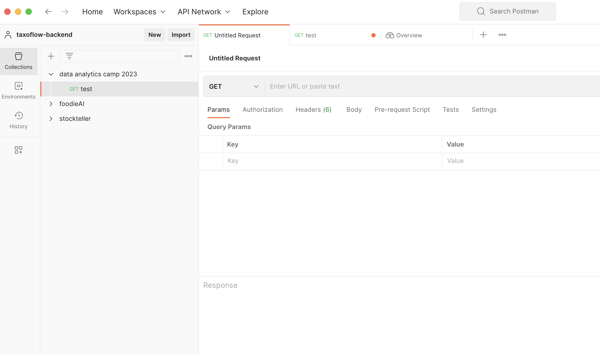
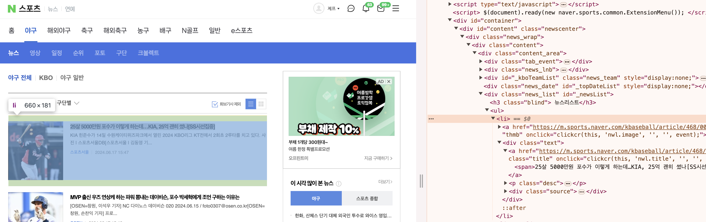

# ch6_analyze_web_service

## Postman 사용하기

시작하기에 앞서서 HTTP 요청을 쉽게 조작할 수 있는 Postman이라는 프로그램을 설치하시기 바랍니다. 브라우저를 이용하면 HTTP GET 요청밖에 보낼 수 없고, 요청에 실어보내는 파라미터를 수정하기가 어렵습니다. postman을 이용하면 HTTP 요청과 관련된 거의 대부분의 기능들을 편하게 사용할 수 있습니다.

[https://www.postman.com/](https://www.postman.com/)



## 웹 사이트 구조 파악

크롤링에 앞서서 내가 데이터를 수집하고자 하는 웹 사이트가 어떻게 동작하는지 파악해야합니다. 내가 원하는 데이터를 수집하기 위해서 웹 페이지를 그대로 수집하면 되는지, 아니면 백엔드 API를 찔러서 데이터를 받아와야 하는지를 결정해야 합니다.

### 크롤링 대상 선정

먼저 수집하고자 하는 데이터를 선정해야합니다. 여기서는 한국 프로 야구와 관련된 국내 기사를 수집해보겠습니다. 네이버 스포츠는 국내 주요 스포츠 미디어들의 기사들을 한 곳에서 모아 볼 수 있는 서비스를 제공하고 있었습니다. 따라서 네이버 스포츠 서비스를 크롤링해서 2022년 한 해 동안의 한국 야구 뉴스 기사들을 수집해보겠습니다.


### URL 구조 파악하기

HTTP GET 요청은 기본 URL 뒤에 ?를 붙인 뒤, 파라미터를 붙여서 요청을 보냅니다. 네이버 스포츠의 경우 아래와 같은 포맷으로 요청을 보내면, 특정일의 특정 페이지 뉴스 기사들을 가져올 수 있습니다.

```python
https://sports.news.naver.com/kbaseball/news/index?isphoto=N&date={"날짜"}&page={"페이지 번호"}
```

```python
# 예시: 2024년 6월 17일 페이지 3
https://sports.news.naver.com/kbaseball/news/index?isphoto=N&date=20230510&page=3
```

### HTML 구조 파악하기
그 다음, 개발자도구를 활용해서 기사 목록 html 코드를 확인해보겠습니다.



<ul> 태그 아래에 <li> 태그들로 기사 아이템들의 목록이 쭉 나와있습니다. 그리고 각 아이템들은 기사 상세 페이지 링크를 담고 있습니다. 즉, 기사 목록 페이지를 요청해서 HTML을 다운받으면, 그 안에 포함된 기사들도 요청할 수 있게 됩니다.

## 크롤러 설계하기

기사 목록 페이지와 기사 페이지의 동작 방식을 알았으니, 크롤러를 설계할 수 있습니다.

1. 원하는 날짜와 페이지의 기사 목록을 요청한다.
2. 기사 목록에서 각 기사들의 URL을 파싱한다.
3. 기사 URL로 요청을 보내서 뉴스 기사 데이터를 수집한다.
4. 원하는 만큼 이 과정을 반복한다.

## 정리

지금까지 데이터를 수집하기 위해 웹 사이트의 구조를 분석하는 일련의 과정을 소개하였습니다. 

1. 크롤링 대상을 선정
2. URL 구조를 분석
3. HTML 구조 분석
4. 크롤러 설계

물론, 데이터를 수집하고자 하는 대상에 따라서 분석 방법은 달라질 수 있습니다. 상황에 따라서 적절하게, 내가 수집하고자 하는 데이터를 모으면 됩니다. 다음 장에서는 본격적으로 python을 이용해 크롤러를 개발해보겠습니다.