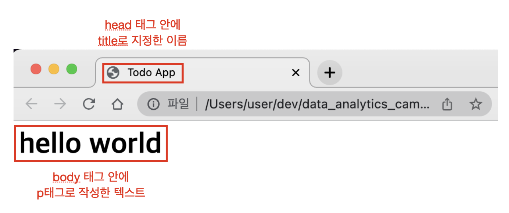

# ch2_html

## HTML

HTML은 HyperText Markup Language의 약자로, 웹 페이지의 뼈대를 만드는 언어라고 생각하면 됩니다. HTML로 뼈대를 잡고, CSS로 디자인을 입히고, 백엔드에서 가져온 데이터로 내용을 채워넣으면 우리가 사용하는 웹 서비스가 됩니다. html만 해도 내용이 꽤나 방대하지만, 우리 과정은 웹 개발 과정이 아니므로 개념을 익히는 수준만 다루고 넘어가겠습니다.

### HTML 파일 기본 구조

html은 기본적으로 태그들로 구성됩니다. 태그는 한번 열여주면 닫아주어야 합니다. 보통 <html> </html> 태그 사이에 <head> </head>와 <body> </body> 태그로 구성됩니다. <head> 태그 안에는 html 문서의 설정과 관련된 내용들이 들어가고, 문서의 실제 내용은 body 태그 안에 들어갑니다.

```html
<html>
	<head>
		<title>Todo App</title>
	</head>
	<body>
	  <h1>hello world</h1>
	</body>
<html>
```

폴더 하나를 만들고, todo.html 이라는 파일을 하나 만든 뒤, 위 코드를 붙여넣고 저장해보겠습니다. 그 다음, 더블클릭하면 웹 브라우저에 아래와 같은 화면이 출력될 것입니다.



즉, 브라우저는 우리가 작성한 html 태그를 렌더링 해줍니다. 이제 다른 태그들도 하나씩 알아보겠습니다.

## 기본 html 태그

### <h1> ~ <h6> 태그

h1이 제일 크기가 큰 텍스트를 나타내고, 크기가 작아질 수록 텍스트의 크기도 작아집니다. 흔히 제목이나 소제목을 나타낼 때 사용합니다. 보통 h1, h2, h3 까지 많이 사용하며, 그 밑으로는 잘 사용하지 않습니다.

```html
<html>
	<head>
		<title>Todo App</title>
	</head>
	<body>
		<h1>Heading level 1</h1>
		<h2>Heading level 2</h2>
		<h3>Heading level 3</h3>
		<h4>Heading level 4</h4>
		<h5>Heading level 5</h5>
		<h6>Heading level 6</h6>
	</body>
<html>
```


### <p>, <span> 태그

텍스트를 표현할 때는 p, span 태그를 많이 사용합니다. p 태그는 paragraph의 약자로 단락을 나타낼 때 사용합니다. p 태그를 사용하면 자동으로 줄바꿈이 됩니다. 반면에 span 태그를 사용하면 자동으로 줄바꿈이 적용되지 않습니다. 

```html
<html>
	<head>
		<title>Todo App</title>
	</head>
	<body>
		<p>hello</p>
		<p>world</p>

		<span>hello</span>
		<span>world</span>
	</body>
<html>
```


이러한 차이 때문에 흔히 여러 줄에 걸쳐서 텍스트가 출력되어야 하는 뉴스 기사 등에는 p 태그를 사용하고, 짧은 텍스트를 출력해야할 때는 span을 많이 사용합니다. 상황에 따라서 적절히 필요한 태그를 사용하면 됩니다.

### <strong> 태그

텍스트를 진하게 표현하고 싶으면 strong 태그로 감싸주면 됩니다. 주로 span 태그와 함께 사용됩니다.

```html
<html>
	<head>
		<title>Todo App</title>
	</head>
	<body>
		<span>
			<strong>
				강조하고 싶은 내용
			</strong>
				그 밖의 내용
		</span>
	</body>
<html>
```


### <a> 태그

외부 링크를 나타내는 태그를 표현할 때는 a 태그를 사용합니다. 예를들어 네이버에서 뉴스를 검색하면 뉴스 목록과 함께, 클릭하면 뉴스 원문 페이지로 이동합니다.


a 태그를 사용하려면 href=”이동하고자 하는 URL”을 넣어주면 됩니다. 이렇게 태그 안에 추가하는 속성 값을 attribute라고 부릅니다.

```html
<html>
	<head>
		<title>Todo App</title>
	</head>
	<body>
		<a href="https://www.naver.com">네이버로 이동</a>
	</body>
<html>
```


###  태그

img를 표현하고 싶다면 img 태그 안에 src attribute에 이미지 경로를 넣어주면 됩니다.

```html
<html>
	<head>
		<title>Todo App</title>
	</head>
	<body>
		<!--텍스트를 나타내는 기본 태그들-->
		<html>
	<head>
		<title>Todo App</title>
	</head>
	<body>
	
	</body>
<html>
```


이미지의 크기가 너무 크면 width와 height attribute를 지정해주면 됩니다. width나 height 둘 중 하나만 지정하면 비율을 유지한 채로 지정한 크기로 조정을 해줍니다.

```html
<html>
	<head>
		<title>Todo App</title>
	</head>
	<body>
		<!--텍스트를 나타내는 기본 태그들-->
		<html>
	<head>
		<title>Todo App</title>
	</head>
	<body>
	
	</body>
<html>
```


### <input> <label> 태그

유저의 입력을 받고 싶다면 input 태그를 사용하면 됩니다. 그리고 어떤 입력을 받는 것인지 표기해주려면 input의 짝궁인 label 태그를 사용하면 됩니다.

```html
<html>
	<head>
		<title>Todo App</title>
	</head>
	<body>
		<!--텍스트를 나타내는 기본 태그들-->
		<html>
	<head>
		<title>Todo App</title>
	</head>
	<body>
		<label for="example">label</label>
		<input id="example" type="text" />
	</body>
<html>
```


우리가 웹 사이트에서 회원가입 등을 할 때 텍스트를 입력하는 부분은 대부분 이 input 태그를 이용하는 것이라고 생각하면 됩니다.

### <ul> <li> 태그

목록을 나타낼 때는 ul과 li 태그를 사용하면 됩니다. ul은 목록을 나타내고, li는 각각의 아이템을 말합니다.

```html
<html>
	<head>
		<title>Todo App</title>
	</head>
	<body>
		<!--텍스트를 나타내는 기본 태그들-->
		<html>
	<head>
		<title>Todo App</title>
	</head>
	<body>
		<ul>
			<li>item 1</li>
			<li>item 2</li>
			<li>item 3</li>
			<li>item 4</li>
		</ul>
	</body>
<html>
```


### <button> 태그

버튼을 표현하고 싶으면 button 태그를 사용하면 됩니다.

```html
<html>
	<head>
		<title>Todo App</title>
	</head>
	<body>
		<!--텍스트를 나타내는 기본 태그들-->
		<html>
	<head>
		<title>Todo App</title>
	</head>
	<body>
		<button>button</button>
	</body>
<html>
```


버튼을 눌렀을 때 수행해야 하는 동작들은 javascript를 이용하여 코딩할 수 있습니다. 이는 javascript 챕터에서 다루겠습니다.

### <div> 태그

특정한 영역을 묶어줄 때 사용하는 태그입니다. 그 자체로 특별한 기능을 제공해주지는 않고, CSS나 Javascript와 함께 사용됩니다. 예를들어 특정한 영역을 묶어서 스타일을 적용하거나 동작을 정의할 때 사용됩니다. 다음 CSS 챕터에서 다루겠습니다.

## 연습문제

지금까지 배운 태그들을 이용하여 아래 화면이 보이도록 todo.html을 코딩해보세요.


## 정리

웹 크롤러는 결국 웹 서버로부터 html 문서를 받아오고, 그 안에 들어있는 데이터들을 파싱하는 프로그램입니다. 때문에 기본적인 html 태그들을 배워봤습니다. 다음 장에서는 HTML 문서에 디자인을 적용하는 CSS에 대해서 배워보겠습니다. 스타일을 적용하기 위해 사용되는 id와 class 값이 크롤링 시에 필수적이므로, 반드시 알아야 하는 내용들입니다.