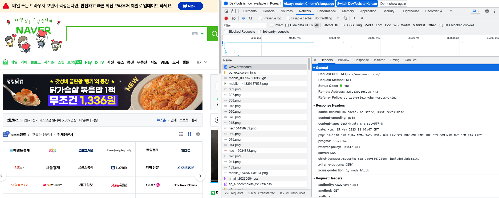

# ch5_chrome_dev_tool

## 크롬 개발자 도구 사용하여 웹 서비스 분석하기

크롬 웹 브라우저의 개발자 도구를 이용하면 웹 사이트를 제공하기 위해서 브라우저와 서버가 주고 받는 데이터들을 확인할 수 있습니다. 네이버에 접속한 다음, 개발자 도구를 열어보겠습니다. 윈도우의 경우에는 F12, 맥북의 경우에는 cmd+option+i 를 누르면 됩니다.

Network 탭으로 이동해보면 우리가 브라우저를 이용해서 [http://www.naver.com이라는](http://www.naver.com이라는) 주소로 접속했을 때, 네이버의 서버로부터 어떤 데이터들을 받아오는지 확인할 수 있습니다. 그러면 지난 시간에 배웠던 웹을 구성하는 3가지 요소인 html, css, javascript 파일들을 다운받는걸 확인할 수 있습니다. 덧붙여서 이미지 파일들까지 서버로부터 내려받고 있습니다.

맨 위에 [www.naver.com](http://www.naver.com) 이라는 항목을 클릭한 뒤, Headers 탭에서 General 항목을 열어보겠습니다.

### Request URL & HTTPS 프로토콜

먼저 Request URL을 보겠습니다. [https://www.naver.com](https://www.naver.com) 이라는 말은 https 프로토콜로 www.naver.com이라는 도메인 주소에 요청을 넣겠다는 뜻입니다. 

일반 HTTP 프로토콜로 통신을 하게 되면, 서버와 통신을 주고 받는 데이터가 암호화되어 있지 않습니다. 예를들어 로그인같은 작업을 일반 HTTP를 통해서 주고 받으면 쉽게 사용자의 비밀번호가 유출될 가능성이 있습니다. 또한 사용자 인증 토큰 같은 값들이 쉽게 유출될 수 있습니다. 이를 방지하기 위해서 SSL이라는 인증서를 바탕으로 데이터를 암호화하여 통신을 주고 받는 프로토콜이 HTTPS입니다.

HTTPS와 관련된 자세한 내용은 아래 강의를 참고해주세요.

[https://www.opentutorials.org/course/228/4894](https://www.opentutorials.org/course/228/4894)

### HTTP method

Request Method가 GET이라는 부분이 보입니다. 이는 HTTP method 중에 GET을 사용했다는 의미입니다. HTTP method는 GET, POST, PUT, DELETE 등이 있습니다. 이는 웹 어플리케이션 개발 시간에 자세히 다뤄보도록 하겠습니다. 우선은 서버로부터 특정 주소의 웹 페이지를 읽어오는 요청들은 모두 GET 메서드를 사용한다고 보면 됩니다.

GET: 서버로부터 데이터를 가져올 때 씀. 우리가 웹 브라우저에 특정 주소를 입력해서 웹 사이트 화면을 볼 수 있는 것들은 모두 이 GET 요청을 쓰는 것

POST: 서버에 새로운 데이터를 추가할 때 씀. 주로 회원 가입하기 등의 요청이 이 POST 요청을 사용

예를들어 위에 가입하기 버튼을 누르면 서버에 회원 정보를 추가하라는 HTTP POST 명령을 보내고, 가입에 성공하면 메인화면으로 redirect를 하는 방식으로 동작

PATCH: 서버에 데이터를 업데이트하라는 메서드. 예를들면 비밀번호 업데이트 요청 등이 이 PUT 명령어를 사용한다.

DELETE: 서버의 데이터를 삭제하라는 요청. 회원 탈퇴 등을 구현할 때 사용한다.

### Status Code

그 아래에는 Status Code: 200이라는 부분이 있습니다. 이는 HTTP 요청에 대한 결과를 코드로 나타낸 것입니다. 주로 많이 사용되는 코드들은 아래와 같습니다. 

20x: 성공

- 200: 성공
- 201: 성공의 결과로 새 데이터가 서버에 생성됨

40x: 내 잘못으로 리퀘스트가 실패했음

- 400: 내가 보낸 리퀘스트의 데이터가 잘못되었음. (ex. 보내야하는 값을 빼먹었거나, 타입이 다를 경우)
- 401:  내가 보낸 리퀘스트가 인증되지 않았음
- 403: 요청을 보내선 안되는 URL로 요청을 보냄
- 404: 없는 URL로 요청을 보냄

50x: 서버 잘못으로 리퀘스트가 실패했음

- 500: 서버 내부에서 예외 발생
- 503: 서버가 뻗음. 혹은 서버가 아직 준비 안됨

보통 웹 페이지를 잘 내려받을 경우, 200 응답이 내려옵니다. 이를 잘 기억하면 됩니다. 이외에 다양한 HTTP response 코드가 궁금하시다면 아래 링크를 참고해주세요.

[https://developer.mozilla.org/en-US/docs/Web/HTTP/Status](https://developer.mozilla.org/en-US/docs/Web/HTTP/Status)

### Remote Address & Port

Remote Address 부분을 보면 실제로 내가 HTTP 요청을 보낸 서버의 IP 주소를 볼 수 있습니다. 우리가 www.naver.com이라는 도메인 주소로 보낸 HTTP 요청이 실은 233.130.195.200 이라는 주소를 가진 서버에 443번 포트로 요청을 보낸 것입니다. 한번 저 주소만 복사해서 브라우저로 요청을 날려보겠습니다.

IP 주소만 복사해서 브라우저로 요청을 날리더라도 우리가 알고있는 네이버 화면을 볼 수 있습니다. 즉, 우리가 브라우저를 통해서 웹 사이트를 사용할 수 있었던 것은 곧, 특정 IP 주소로 HTTP  요청을 날린 것이고, 그 결과로 리턴되는 HTML 문서를 렌더링한 결과를 보는 것입니다.

### Response

앞서서 Request와 Status Code를 살펴봤습니다. [https://www.naver.com이라는](https://www.naver.com이라는) URL로 HTTP GET 요청을 보냈고, 그 결과로 요청이 잘 처리됐다는 200 응답 코드를 받았습니다. 그러면 응답을 확인해봐야겠죠? 개발자 도구의 Response 탭을 열어보면 HTTP 요청의 결과를 확인 가능합니다.

Hyper Text Transfer Protocol이라는 이름답게 html 문서가 전달된 것을 볼 수 있습니다. 그 안에 script라는 테그 안에 적혀있는 코드는 javascript 코드입니다. 브라우저가 이 html 파일을 렌더링하면서 수행하는 각종 로직들이 코딩되어 있다고 생각하면 됩니다.

## 정리

이번 챕터에서는 크롬 개발자 도구를 이용해서 웹 서비스를 제공하기 위해 서버와 클라이언트가 주고 받는 데이터를 확인하는 방법을 알아보았습니다. 이 외에도 개발자 도구는 다양한 분야에 사용되니, 꼭 사용법을 익히고 넘어가면 좋겠습니다.