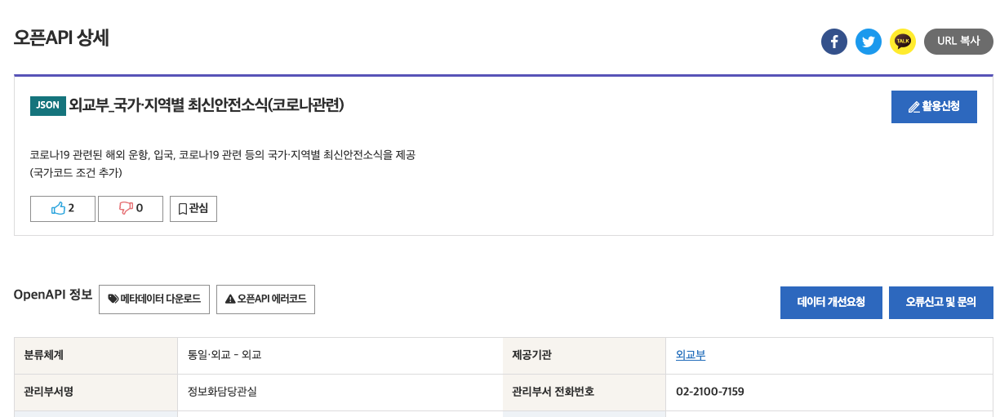

# ch9. openAPI 크롤링

## openAPI 활용

정부 등에서 공개한 API를 활용하여 데이터를 수집할 수도 있습니다. 세미 프로젝트 주제에 맞게 코로나 관련 openAPI를 한번 활용해보겠습니다.

데이터 셋 주소: [https://www.data.go.kr/tcs/dss/selectApiDataDetailView.do?publicDataPk=15080336](https://www.data.go.kr/tcs/dss/selectApiDataDetailView.do?publicDataPk=15080336)

openAPI 활용을 신청하고, 적당한 사유를 입력하면 API를 요청할 수 있는 키 값을 발급해줍니다. 승인받은 API 목록 및 API 키 값들은 마이페이지에서 확인이 가능합니다.

이제 인증키를 가지고 사용법을 참고하여 postman으로 요청을 날려보면 됩니다. 

ISO 2자리 국가코드를 이용해서 요청을 날려보겠습니다. 

ISO 국가코드: [https://ko.wikipedia.org/wiki/국가별_국가_코드_목록](https://ko.wikipedia.org/wiki/%EA%B5%AD%EA%B0%80%EB%B3%84_%EA%B5%AD%EA%B0%80_%EC%BD%94%EB%93%9C_%EB%AA%A9%EB%A1%9D)

JSON 형태로 응답이 잘 내려온 것을 확인할 수 있습니다.

## 연습 문제

코로나 최신 뉴스 공공 API를 신청하고, python requests를 이용해서 영국, 프랑스, 독일의 최신 코로나 관련 뉴스를 10개씩 수집해보세요. 만약 전체 데이터가 10개가 되지 않을 경우, 모든 전체 데이터를 수집하여 csv 파일에 저장하세요.